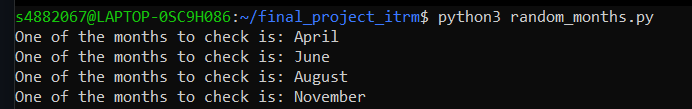

# Final Project Introduction to Research Methods

The code for the research whether ok/OK/O.K. is used more often than oke/oké/okay on Dutch Twitter.  

## Versions  
The Ubuntu version used is Ubuntu 20.04.3 LTS  
The Python version used is Python 3.8.10  
The twitter data collected is data from 2021, the months April, June, August and November (more on this below)  


## Month Randomizer
This code includes a month randomizer, with the month randomizer you can avoid cherry-picking data by using random months for the experiment. The months I used are April, June, August and November of 2021. I chose the year 2021 so the data is new in comparison to, for example, 2016. I only chose four months seeming that it takes a long time to process one month, using all twelve months was too much for the given amount of time. Randomizing these months gives us fair and representative data.  

You can run the month randomizer by using the following code:  

```$ python3 random_months.py```  

Here is the output of the randomized months when i first ran it:


## Obtain the data
The way you can obtain the data I used is by using the following commands (when you have downloaded the github files.)  
The data that needs to be obtained is the text from tweets in 2021, in the months April, June, August and November.

First you have to use the command:  
```$ scp get_text.sh s4882067@karora.let.rug.nl:/home/s4882067```  
Use your own RUG number ofcourse. This lets you upload the code to the karora server.

Then login to karora using your own RUG number:  
```$ ssh s4882067@karora.let.rug.nl```  

When you are logged into karora you can run bash script with:  
```$ bash get_text.sh```  

After you have done this (which will take a while), you can logout of karora with the command  
```$ logout```  

After you have logged out and copied the files you can download them to your pc with the following command. This also downloads them
to the repository you are in right now:  
```
$ scp s4882067@karora.let.rug.nl:tweets202104.txt .  
$ scp s4882067@karora.let.rug.nl:tweets202106.txt .  
$ scp s4882067@karora.let.rug.nl:tweets202108.txt .  
$ scp s4882067@karora.let.rug.nl:tweets202111.txt . 
   
```  

